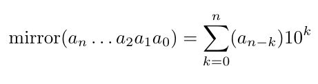
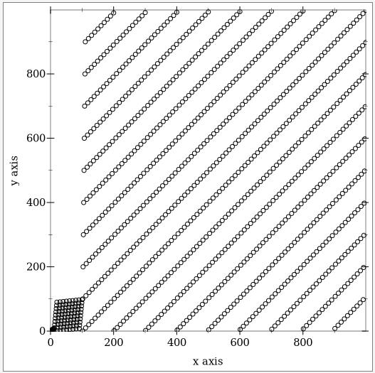
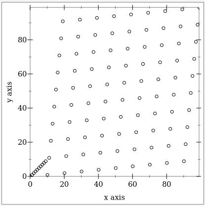

# mirror-numbers
A visualizer for sequences of mirror numbers.

The mirror of a natural number is defined to be the natural number with each digit transposed from its index from the left _i_ to the position _i_ indexed from the right (i.e., miror(anan-1an-2...a0) = a0...an-2an-1an; e.g., mirror(234) = 432).

Mathematically this can expressed as the following summation:

I made this visualizer in racket (using the built-in plot-gui-lib) while pondering what sorts of behavior mirror numbers would exhibit viewed as a sequence.

## Usage:
`./mirror.rkt [[start] end]`
If omitted, `start` and `end` default to 0 and 1000, respectively.

Examples:
`./mirror.rkt`:

`./mirror.rkt 100`

`mirror.rkt` also contains a function `(list-mirrors start end)` that can be used to create the list of mirror numbers ranging from `start` to `end`.
